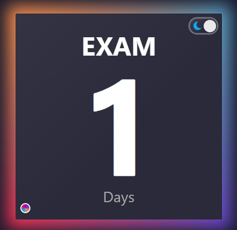
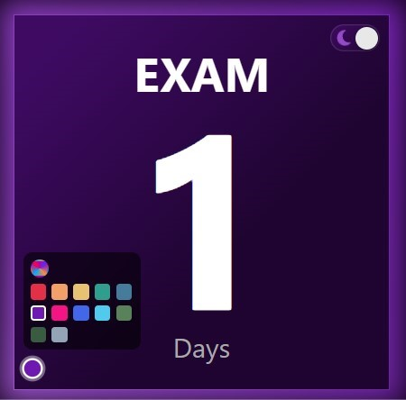
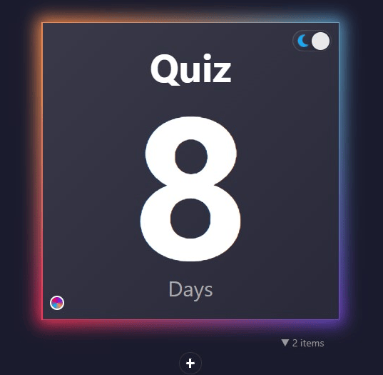
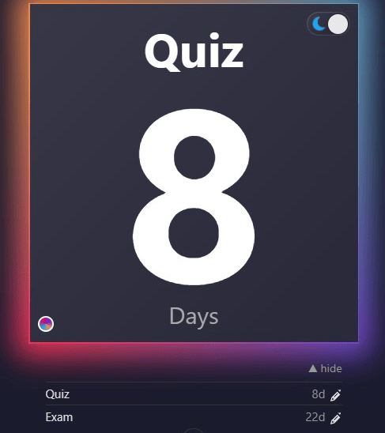

# DueDate

A small desktop countdown gadget for tracking deadlines.

- Add/edit tasks with a title and due date
- Main card shows the soonest due task
- Dark / light mode toggle
- Customizable backgrounds: Classic preset or pick from a color map
- Data stored locally

## Demo
### Color themes

<p align="center">
  
  
  
</p>

<table>
  <tr>
    <td align="center">
      <h3>Dark/light mode</h3>
      
    </td>
    <td align="center">
      <h3>Tasklist</h3>
      
    </td>
  </tr>
</table>


## Stack

- Tauri
- React
- localStorage
- GitHub Actions

## Layout

```
src/
  app/           # root React app
  components/    # UI pieces (theme toggle, background picker, etc.)
  lib/           # countdown, backgrounds, localStorage
  styles/        # global CSS
src-tauri/       # desktop shell
```

## Setup

Needs:

- Node.js
- Rust (`rustup`)
- Visual Studio Build Tools (C++ workload) on Windows

```bash
npm install
```

## Run

Browser UI (fastest for UI work):

```bash
npm run dev
```

Desktop window (dev mode — first launch compiles Rust and can take a few minutes):

```bash
npm run desktop
```


## Test

```bash
npm test
npm run lint
```

## License

For personal and educational use.